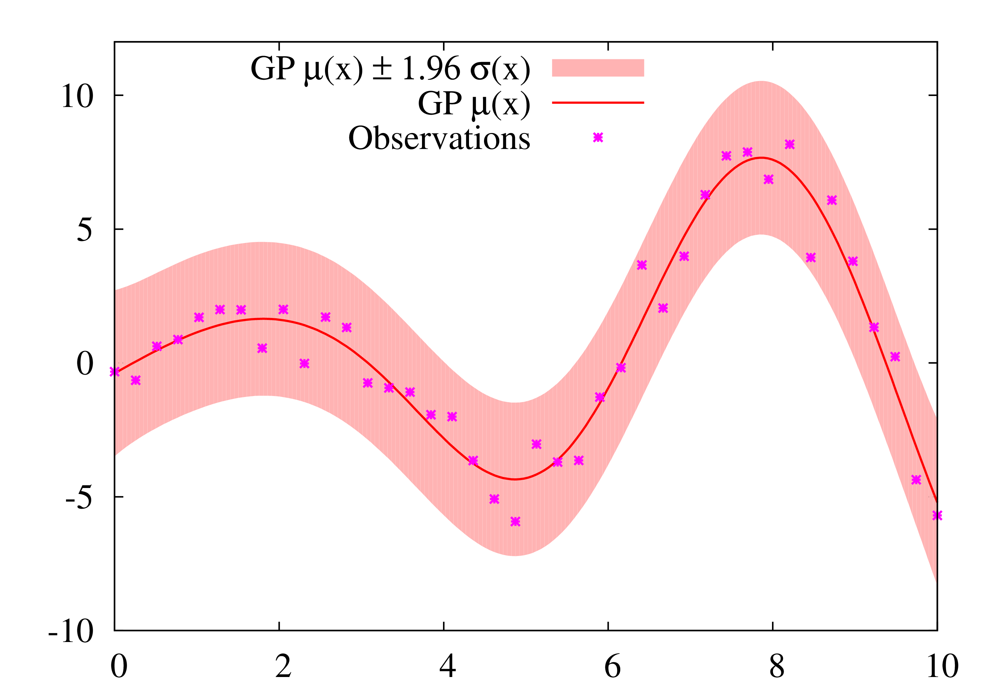

===========================
Gaussian Process Regression
===========================

A simulation is seen as a function :math:`f(x)+\epsilon` (:math:`x \in \mathbb{R}^D`) with additional random error :math:`\epsilon \sim \mathcal{N}(0,v_t)`.
This optional error is due to the stochastic nature of most simulations.

.. note::
	This error does not depend on :math:`x`.
	An extension to model an error depending on :math:`x` will be added in the future.

The :doc:`GaussianProcess <api/skgpuppy.GaussianProcess>` module uses regression to model the simulation as a Gaussian process.
We refer to Girard's thesis [#]_ for a really good explanation of GP regression.

	"A Gaussian process is a collection of random variables, any finite number of which have (consistent) joint Gaussian distributions."
	-- Rasmussen, C. E. Gaussian Processes in Machine Learning, Advanced Lectures on Machine Learning, Springer Berlin Heidelberg, 2004, 3176, 63-71

	"Once the mean and covariance functions are defined, everything else about GPs follows from the basic rules of probability applied to multivariate Gaussians."
	-- Zoubin Ghahramani

.. note::
	The following explanation is an excerpt from my paper [#]_.

:math:`m(x) = E[G(x)]` (:math:`x\in\mathbb{R}^d`) is the mean function of the Gaussian process and :math:`C(x_i,x_j) = \mathrm{Cov}[G(x_i),G(x_j)]` is the covariance function.
For any given set of inputs :math:`\{x_1,\dots,x_n\}`, :math:`(G(x_1),\dots,G(x_n))` is a random vector with an :math:`n`-dimensional normal distribution :math:`\mathcal{N}({\mu},\Sigma)`.
:math:`{\mu}` is the vector of mean values :math:`(m(x_1),\dots,m(x_n))` and
:math:`\Sigma` is the covariance matrix with :math:`\Sigma_{ij} = C(x_i,x_j)`

For modeling :math:`f(x)`, we use the Gaussian squared exponential covariance function :math:`C(x_i,x_j) = v \exp \left[-\tfrac{1}{2}(x_i-x_j)^T {W}^{-1}(x_i-x_j)\right]`, as it performs well regarding accuracy.
Without loss of generality, we use :math:`m(x)=m`.

:math:`{W}^{-1} = \mathrm{diag}(w_1,\dots,w_d)` and :math:`v` are hyperparameters of the Gaussian process.
We have a set of observed simulation results :math:`\mathcal{B} = \{(x_i,t_i)\}_{i=1}^N` as supporting points with :math:`x_i \in \mathbb{R}^d` and :math:`t_i = f(x_i)+\epsilon_i`  with white noise :math:`\epsilon_i \sim \mathcal{N}(0,v_t)`.
This noise represents the aleatory uncertainty of the simulation that calculates :math:`f(x)`.

To model the noisy observations :math:`t_i` we use :math:`K=\Sigma + v_t I` as covariance matrix for regression.
Therefore, we have an additional hyperparameter :math:`v_t`.
The hyperparameters :math:`W^{-1}`, :math:`v_t`, and :math:`v` can be estimated from a given dataset with a maximum likelihood approach.
In the following, we use :math:`{\beta}={K}^{-1}{t}` with :math:`{t} = (t_1,\dots,t_N)^T` to simplify notation.

Now, the Gaussian process can be used as a surrogate for the simulation model.
The prediction  :math:`\mu(x)` and code plus aleatory uncertainty :math:`\sigma^2 (x)` at a new input :math:`x` is:

.. math::
	\mu (x) &= \sum_{i=1}^N \beta_i C(x,x_i) \\
	\sigma^2 (x) &= C(x,x) - \sum_{i,j=1}^N K_{ij}^{-1}C(x,x_i)C(x,x_j) + v_t

1-d Example:

**Usage**: See :doc:`getting_started`

References
----------

.. [#] Girard, A. Approximate Methods for Propagation of Uncertainty with Gaussian Process Models, University of Glasgow, 2004
.. [#] Baumgaertel, P.; Endler, G.; Wahl, A. M. & Lenz, R. Inverse Uncertainty Propagation for Demand Driven Data Acquisition, Proceedings of the 2014 Winter Simulation Conference, IEEE Press, 2014, 710-721
	(https://www6.cs.fau.de/publications/public/2014/WinterSim2014_baumgaertel.pdf)
