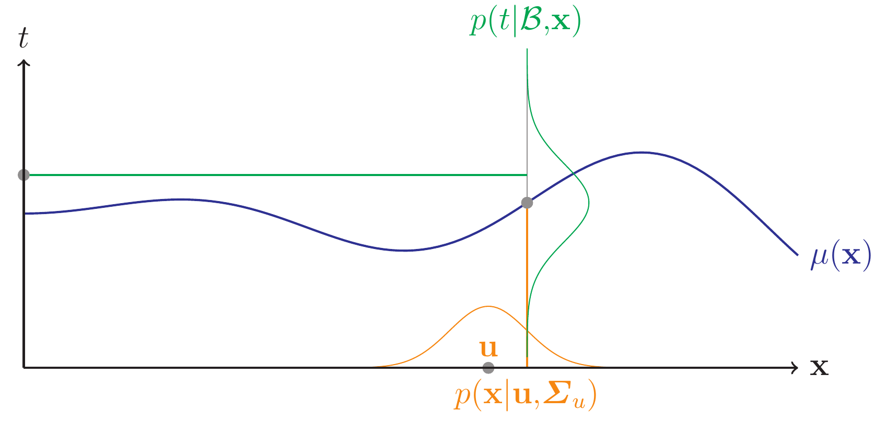

=======================
Uncertainty Propagation
=======================

The :doc:`UncertaintyPropagation <api/skgpuppy.UncertaintyPropagation>` module allows for propagating uncertainty
:math:`x \sim \mathcal{N}(u,\Sigma_u)` through the Gaussian process to estimate the output uncertainty of the simulation.
This is based on Girard's thesis [#]_.

.. note::
	The following explanation is an excerpt from my paper [#]_.

We assume that the input parameters will be estimated from real world data using a maximum likelihood approach.
Under this assumption, we can represent the uncertainty about an input parameter as a normal distribution.
For an uncertain input :math:`x \sim \mathcal{N}(u,\Sigma_u)`, the output distribution can be written as:

.. math::
	p(t|\mathcal{B},u,\Sigma_u) = \int_{-\infty}^{\infty} p(t|\mathcal{B},x)p(x|u,\Sigma_u) \mathrm{d} x

This formula is illustrated in the following figure:

Here, :math:`\Sigma_u` is the covariance matrix of the uncertain input and incorporates the uncertainty and dependencies between the input parameters.
As the distribution :math:`p(y|\mathcal{B},u,\Sigma_u)` is hard to determine analytically, Girard approximates its mean and variance:

.. math::
	m(u,\Sigma_u) &= \mu(u) + \tfrac{1}{2} \sum_{i=1}^N\beta_i\mathrm{Tr}[C''(u,{x_i})\Sigma_u]\\
	v(u,\Sigma_u) &= \sigma^2(u) + \tfrac{1}{2} \mathrm{Tr} [C''(u,u)\Sigma_u] - \sum_{i,j=1}^N (K_{ij}^{-1} - \beta_i \beta_j)\mathrm{Tr}[C'(u,x_i)C'(u,x_j)^T\Sigma_u]\\
	&- \tfrac{1}{2} \sum_{i,j=1}^N K_{ij}^{-1} \bigg( C(u,x_i)\mathrm{Tr} [C''(u,x_j)\Sigma_u] + C(u,x_j)\mathrm{Tr} [C''(u,x_i)\Sigma_u]\bigg)

:math:`C'` is the Gradient and :math:`C''` is the Hessian of the covariance function.
In case of the squared exponential, :math:`C''(u,u)` equals `0`.
As this approach makes no special assumptions about the covariance function, other functions can be plugged into this method as long as they are twice differentiable.

We use this approximation for the output uncertainty :math:`v(u,\Sigma_u)` as a basis for our inverse uncertainty propagation.
At this point, the uncertainty propagation uses two layers of approximation: First, the simulation is approximated by a Gaussian process and second, the uncertainty propagation
is done using an approximate formula.

Using this approach, we can clearly distinguish between aleatory, epistemic and code uncertainty.
Aleatory uncertainty is represented by :math:`v_t`, code uncertainty is represented by :math:`\sigma^2(u)-v_t` and epistemic uncertainty is :math:`v(u,\Sigma_u) - \sigma^2(u)`.

**Usage**: See :doc:`getting_started`

References
----------

.. [#] Girard, A. Approximate Methods for Propagation of Uncertainty with Gaussian Process Models, University of Glasgow, 2004
.. [#] Baumgaertel, P.; Endler, G.; Wahl, A. M. & Lenz, R. Inverse Uncertainty Propagation for Demand Driven Data Acquisition, Proceedings of the 2014 Winter Simulation Conference, IEEE Press, 2014, 710-721
	(https://www6.cs.fau.de/publications/public/2014/WinterSim2014_baumgaertel.pdf)
